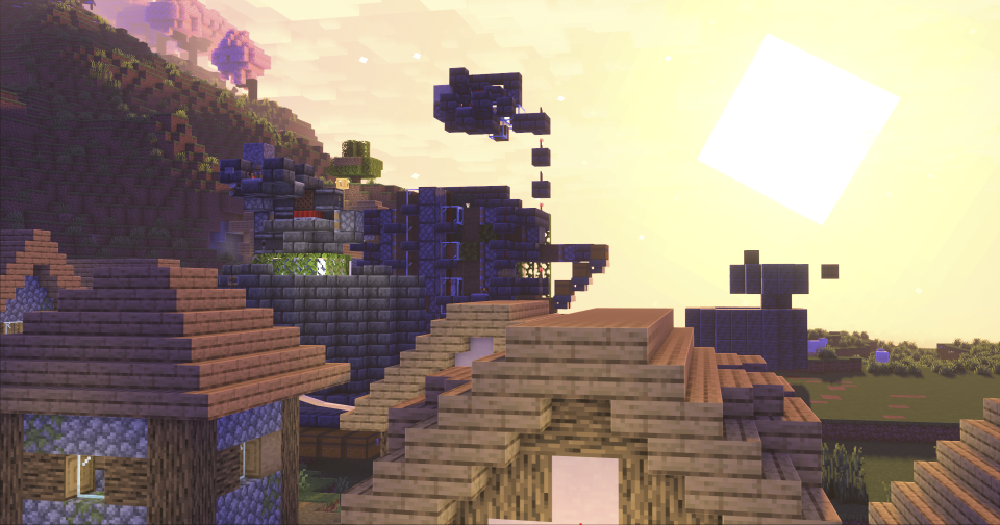
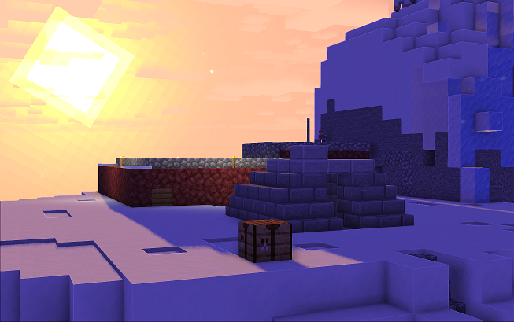
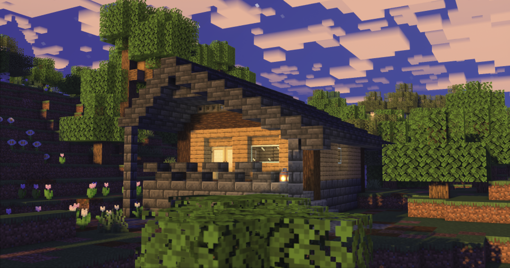

---
authors:
  - name: MEGATREX4
    mc: Yevhen4
editors:
  - name: kork0za
    mc: kork0za
date: 2025-10-18
preview: https://i.ibb.co/XxxsffBM/2025-02-18-00-12-13.png
page-link: sub_2025
title: "Історія, Закарбована у Блоках: Карта 5 Сезону M4SUB Доступна для Завантаження"
description: "Повна мапа нашого сервера вже доступна! Це не просто файл — це архів спільних пригод, моментів і історій, які ми прожили разом за цей рік."
generateTOC: true
---

Ми трошки забарилися з цим анонсом, але нарешті можемо представити вам повну мапу нашого чудового сервера, на якому ми провели майже цілий рік! Це не просто файл, це справжній цифровий архів наших спільних моментів та історій, про деякі з них я хочу поговорити тут.

## Сезон спільноти та креативу

Цей сезон був наповнений купами різних історій — від дружніх конфліктів до створення мега-будівель, дивовижних картин та комедійних ситуацій. Гравці з задоволенням будували, подорожували та займалися саме тими речами, що їм були цікаві.

Ми насолоджувалися годинами контенту та розмов у голосовому чаті. Сотні стрімів, купа будівель створених гравцями, та години спільного часу відображали особистий ріст кожного, доводячи, що сезон став чимось більшим, ніж просто гра.

Варто зазначити, що ріст проєкту M4SUB став можливим саме тому, що спільнота використовувала його як місце для якісного відпочинку. Це справжній успіх нашої спільноти, який ми зробили разом.

## Спогади @Smilycat3055999: Епоха гірського кола

Наша модераторка 5-го сезону, **@Smilycat3055999**, поділилася своїми найяскравішими враженнями, і вони чудово описують ту атмосферу раннього етапу проєкту. Її слова були наповнені ностальгією за тим часом, коли більшість гравців оселилася в одному компактному регіоні:

> "Було весело, мені подобалось те, що більшість гравців жили в цьому колі, оточеному горами. Всі щось будували і на це було цікаво дивитися! А ще було легко знайти того, хто потрібен. З історій я часто згадую перші дні серверу, як тільки все почало з'являтись та знайомство з гравцями."

Цікаво, що її база – це справжній витвір мистецтва маскування та просторової організації. На поверхні стояв маленький і досить непримітний будиночок, який нічим не привертав уваги. Проте варто було спуститися драбиною, як відкривався цілий підземний маєток з окремими зонами. Там був і справжній бар, виконаний у теплому дереві, і цілий загін для тварин, і навіть відділ з бджолами.

<gallery path="kit_house_5s"></gallery>

## Спогад про @Fursikr: Золота основа спільноти

Гравець **@Fursikr**, без сумніву, залишив один із найбільш важливих та функціональних слідів на сервері. Майже на самому старті сезону, коли ресурси були ще досить обмеженими, він продемонстрував справжній інженерний хист, збудувавши одну з перших і найефективніших **ферм**!

Ця ферма швидко стала одним із наріжних каменів нашої спільноти, забезпечуючи нас цінним ресурсом для торгівлі, їжі та крафту. У певному сенсі, його ініціатива зробила життя усіх гравців набагато простішим, дозволяючи зосередитися на творчості та будівництві, а не на рутинному фармі, хоча і цього було достатньо. Це був приклад того, як одна продумана ініціатива може мати колосальний вплив на весь проєкт протягом усього сезону. Велика подяка за цей золотий внесок!

## Спогади @kork0za: Архітектор та кочівник

Наш головний архітектор та справжній майстер будівництва — **@kork0za**. Коли я поділився з ним фінальною мапою, його вичерпна оцінка сезону була максимально лаконічною та прямою, що відображає його стриманий характер:

> "ну класно"

Це, безумовно, найкращий підсумок сезону! Проте, за цим лаконічним "класно" криється неймовірна історія його життя на сервері, яка була справжньою епопеєю кочівника та архітектурних експериментів.

Він постійно змінював локації, перетворюючи кожне нове місце на унікальний архітектурний об'єкт. Його подорож виглядала так:

1. **Початковий Етап:** Він оселився у двоповерховому будинку прямо посеред спавну, одразу беручи участь у центральному житті сервера.

_на зображені будинок ще не закінчений, потім до нього було додано другий поверх та дах_

2. **Драматичний Переїзд:** Після скандального вибуху, що стався через іншого гравця (звісно, ми згадуємо той самий вибух від @hnufelka!), йому довелося оперативно переїхати. Новим притулком стала печера, розташована під Мовним Деревом, він обвісив кожну стіну картинами.

3. **Таємнича Оселя:** Далі він мешкав у неймовірно таємничому будинку-грибі, який був наповнений купою різних таємних ходів та проходів, створюючи атмосферу загадковості.

4. **Фінальний Подарунок:** Під самий кінець сезону він оселився у вулику, який став чудовим подарунком на його день народження від @hnufelka та @Yevhen4.

<gallery path="hbkork0za"></gallery>

Його нездійснений задум про будинок-піксель-арт Нянкета (Nyan Cat) теж заслуговує на згадку, як символ його постійного бажання творити щось неймовірне та експериментальне. Його історія — це чудова ілюстрація того, як гравці творили історію, навіть просто змінюючи місце проживання, перетворюючи кожну локацію на новий архітектурний експеримент.

### Проєкт «С.К.А.Л.К.»

Одним із найяскравіших епізодів, пов’язаних із @kork0za, став його експеримент під назвою **«С.К.А.Л.К.»**. Якось йому спала на думку ідея розростити скалк по великій території сервера за допомогою скалкового каталізатора. Для цього він домовився з гравцем **@roll_54** про купівлю одного каталізатора.  

Нікому не розповівши про свої амбіції, @kork0za розмістив каталізатор приблизно на тому місці, де нині стоїть **статуя @hnufelka**. Згодом процес вийшов з-під контролю — скалк почав поширюватися надзвичайно швидко, і до цього “проєкту” долучилися також гравці **@hnufelka**, **@Smilycat3055999** та **@DavonMCJE**.  

З часом у зараженій зоні навіть з’явилася **ферма монстрів**, а поблизу спавну одне з сіл повністю **вимерло** через активність скалку. Урешті, всі його залишки та ферму було прибрано напередодні дня народження @hnufelka. Проте ця подія назавжди залишилася в нашій пам’яті — як символ неконтрольованих експериментів і спільних пригод, що робили сезон живим і непередбачуваним.

## Спогади про гравця @Levcko: Вишневе дерево та агітаційна кампанія

Гравець **@Levcko** був одним із тих, хто обрав собі затишне, але при цьому помітне місце для життя недалеко від Спавну — приблизно у 5-7 хвилинах пішої ходи.

Його база була спроєктована як величезне **Вишневе Дерево**, що одразу привертало увагу і додавало яскравого акценту до пейзажу.

### Білдборд і початок пригод

Вже в перший день свого приєднання до сервера **@Levcko** побудував величезний білдборд зі стрілочками, який вказував напрямок до його будинку. Цей жартівливий підхід до навігації був не просто примхою, а прямою реакцією на унікальну механіку сервера: справжні координати гравців були приховані і їх можна було отримати лише після складних подорожей до Міста Вардена.

Оскільки точна навігація була ускладнена, білдборд став його іронічним, але вкрай корисним засобом вказівки шляху, задавши тон його подальшим діям.

### Ранні подорожі та археологічні відкриття

Окрім будівництва біля Спавну, **@Levcko** також брав активну участь у ранніх дослідженнях світу. На початку сезону ми з ним вирушили в подорож за ресурсами, яка несподівано перетворилася на археологічну експедицію.

Ми натрапили на ділянку розкопок і вирішили зупинитися, щоб вичистити стародавні будівлі. Це було захоплююче заняття, оскільки нам вдалося зібрати значну кількість унікального луту, який можна було отримати лише за допомогою механіки археології. Цей спільний досвід дослідження та збору рідкісних предметів став яскравим моментом початку сезону.

### Виборча агітація та жарти

Через деякий час, коли **@kork0za** розпочав жартівливу кампанію з "дискредитації" мера (@Yevhen4), **@Levcko** перетворив це на справжні вибори. Він активно включився у кампанію, але... на протилежному боці!

Він почав ходити по всіх рандомних місцях на Спавні та встановлювати таблички з написами-агітаціями. Це було неймовірно смішно, коли посеред будівель гравці знаходили підписані оголошення: **"Голосуйте за Мегатрекса"**. Його зусилля створили ефект справжньої, хоча й абсолютно комічної, політичної боротьби на сервері.

<gallery path="Levcko_5s"></gallery>

## Спогади про гравця @tYMOTHY2396: Гобіт, печери та порохові статки

### Несподіване знайомство

Наша історія з @tYMOTHY2396 почалася не на сервері M4SUB, а під час спільної гри на міні-іграх популярного стороннього сервера. Тоді я, **@hnufelka** та **@kork0za** грали разом, а **@tYMOTHY2396** зайшов до нас на стрім. Саме там ми й познайомилися.

Через деякий час, відчувши атмосферу спільноти, він вирішив доєднатися до нашого сервера, принісши із собою свій унікальний стиль гри.

### Житло гобіта: Незавершений камінь

На сервері він обрав для себе роль **Гобіта**, розпочавши масштабне будівництво. Він викопав розгалужену мережу кімнат прямо всередині гори.

Проте, попри свій затишний вигляд зовні, його житло так і залишилося частково незавершеним: це були переважно пусті кімнати з сірими кам'яними стінами, що чекали на фінальне оздоблення.

### Легендарні запаси пороху

Найбільше @tYMOTHY2396 запам'ятався своєю завзятістю у видобутку ресурсів. Він проводив величезну кількість часу в AFK на фермі пороху, що дало приголомшливий результат.

Завдяки його терпінню, у нього в запасі були **десятки шалкерів (shulker boxes) з порохом**.

Ці запаси, які були зібрані фактично однією людиною, стали **легендарними** та забезпечили сервер значним ресурсом для виробництва феєрверків та інших предметів.

## Легенда про день народження @hnufelka

Один із найзворушливіших та найвеселіших моментів сезону, який яскраво демонструє нашу спільноту, — це святкування Дня Народження глядачки під ніком **Хнюфлька**, яке отримало назву "**Ultimate Super Silly Goofy Шляпа hnufelka\'s Birthday Party**"!

Увесь центральний сегмент стріму був присвячений цьому сюрпризу. Ми з @kork0za попросили усіх слідувати за спавн, щоб показати творіння. Вся компанія вирушила до локації через "супер секретний тунель", де, як обіцяв я, усіх чекало "супер круте, що ми побудували для тебе".

Головна локація, яку спроєктував та частково збудував @kork0za (він використовував мод Лайтматика для планування), а фіналізували @tYMOTHY2396 та @Yevhen4, була справжнім витвором архітектури:

*   **Сюрприз:** Спочатку ми збудували величезну "коробку" з білого та рожевого бетону, щоб сховати статую до урочистого відкриття.
*   **Центральний Елемент:** У центрі стояла статуя, яка попіксельно відтворювала скін Хнюфльки, і яку створив @kork0za. Маникен ж персонажа Балді (Baldi) привела на святкування @Smilycat3055999. Коли коробка була прибрана, ми запустили феєрверки! Навколо статуї розмістилися святкові частування: "цукерки", "морозиво", "бургер", а також фігурки Кірбі та кошики.
*   **Подарунки:** Усі гравці принесли Хнюфльці подарунки. Вона також отримала особливий музичний подарунок — її улюблену платівку chirp (диск з Minecraft).

Атмосфера була настільки святковою, що навіть цементова стіна не витримала і впала! І, звісно, ми запустили мега-крутий феєрверк за допомогою кастомної логіки скрипту, щоб зробити свято по-справжньому яскравим та незабутнім!

Опісля стався курйозний момент, коли в чаті жартома привітали Хнюфльку "з десятиріччям", на що вона з посмішкою пожартувала, що їй "12, але дякую" (хоча насправді була старша).

Після демонстрації локації, усіх одразу запросили "розкладаємо тортики, їмо тортики негайно" та зібралися разом зі статуєю персонажа, щоб зробити епічне "сімейне фото з Балді". Я заскріншотив цей момент і урочисто оголосив, що статуя "залишиться назавжди, як спогад цього день народження".

<gallery path="hbhnufelka"></gallery>

Це був один із найбільш емоційних моментів сезону!

**Відео з дня народження:** 

## Спогади про @\_Plyster\_: від творця до та й до Бану

Гравець **@\_Plyster\_** запам'ятався своєю творчістю та мемами. Він був активним учасником спільноти, створив велику ферму мобів, що приносила користь усім, і навіть долучився до створення кількох піксель-артів, прикрашаючи ландшафт. Але, схоже, з часом він втратив інтерес до гри, і його фінальний акорд став досить драматичним.

Свій остаточний вихід із сервера він зробив феєрично: влаштував масштабний вибух, що не пощадив ні його власний будинок, ні його статую біля спавну, ні, на жаль, статую @hnufelka, збудовану на її день народження. Через це руйнування біля спавну та меморіальної статуї, **@\_Plyster\_ був забанений** на проєкті.

Після його бану місце, де стояв будинок, довго лишалося зруйнованим, аж поки спільнота не вирішила відновити його — на тому місці було зведено парк “Плайстра”, як символ нових початків і спогад про його яскраву, хоч і суперечливу історію.

## Спогади @DONKI_F та @Dr_Fetuser: Катарсис, суд та дружба

Ці два гравці були нерозлучними у своїх пригодах, і їхня спільна історія стала справжньою легендою сезону.

### @DONKI_F: Функціональність, хаос та спортивна праця

Гравець **@DONKI_F** став синонімом практичної функціональності, хоча й поєднував це з абсолютним хаосом у певних моментах. Його житло, яке він ділив з іншими (зокрема з **@Dr_Fetuser**), було справжнім логістичним центром: там розміщувалися важливі ферми кругляку та дерева, що були життєво необхідними ресурсами.

Він був справжнім перфекціоністом та із задоволенням брався за найважчу роботу, як-от викопування величезних територій 10x10 чанків.

#### Цитати та спогади від @DONKI_F:

@DONKI_F високо оцінив динамічні елементи сезону, поділившись своїми враженнями:

> "Дуже сподобалось викопувати 10х10 чанків. Також сподобався івент з Геробріном. О, дуже сподобались Напої від **@roll_54**!"
>
> "Також дуже зайшло чарування на арбалет. Це була бомба."

#### Легенда про судовий процес

Головною легендою цього сезону, яка досі недооцінена глядачами, став **Судовий Процес**. Він розпочався через масштабні крадіжки верстатів по всьому серверу та скандальну побудову величезної фігури з цих верстатів біля будинку **@DONKI_F** та його друга, підсудного **@Dr_Fetuser**. Це була феєрична подія, до якої @DONKI_F серйозно готувався!

Його прямий коментар про цю подію говорить сам за себе:

> "Також був цікавий суд, до якого я серйозно готувався, а по ітогу мені просто сказали: 'Абсолютно байдуже' (це цензурна версія вислову)
>
> і суддю вбили молотом, не знаю хто)"

Це був чистий, рафінований, кріндж та, щиро кажучи, мега-смішний момент. Запис цього незабутнього моменту можна знайти тут:

*Цей стрім дійсно недооцінений!*

## @Dr_Fetuser: Свіжий погляд та культурна інтеграція

Його товариш по пригодах, **@Dr_Fetuser**, який приєднався до нас із Казахстану, спочатку спілкувався англійською. Він поділився надзвичайно теплим відгуком, який ідеально підсумовує дух сервера та його особистий прогрес:

> "На сервері є аддони, але ванільний досвід не втрачено. Хороше, доброзичливе і не надокучливе ком'юніті, з усіма можна поговорити на якусь тему і кожен гравець щось робить і не сидить на місці. Красиві споруди та масштабні проєкти. Адмін добрий і допоможе, якщо треба. Трохи важко було не україномовному гравцеві перебувати на цьому сервері, але завдяки цьому я став розуміти українську без перекладача."

Його відгук є яскравим свідченням того, що M4SUB — це не просто сервер, а середовище, що сприяє культурній інтеграції та навчанню. Незважаючи на мовний бар'єр, він був доброзичливим, дотримувався правил та інтегрувався у спільноту. Його особистий успіх у розумінні української мови — це несподіваний, але дуже цінний бонус сезону!

**"Сезон бомба, чекаю нового!"** — ось його фінальний вердикт від @DONKI_F!

## Спогади @roll_54: майстер хаосу та напоїв

Гравець @roll_54 був однією з найяскравіших і найбільш динамічних фігур сезону, поєднуючи технічні експерименти, соціальні івенти та архітектурну співпрацю. Він поділився своїми спогадами, які ідеально відображають дух серверу:

### Про технічні аспекти та рефлексія

> "Було цікаво грати на ваніла+ сервері з плагінами розробляючи фулл модовий сервер, Проте деякі аспекти могли бути лишніми."

Це слушне зауваження. Дійсно, коли використовуєш готові плагіни, деякі аспекти можуть бути зайвими. Беручи до уваги цей цінний досвід та відгуки гравців, ми впевнено рухаємося до того, що наступні сезони M4SUB все більше і більше робитимуться виключно на унікальних, авторських механіках, яких ви ще ніде не бачили. Це дозволить нам не тільки обійти зайві готові елементи, але й гарантувати найбільш свіжий та неповторний ігровий досвід.

### Про напої та будівництво

> "Варіння Напоїв і як пів сервера до мене ходили пити 'Абсцент 5 звіздачек', особливо @DONKI_F. Те що я і @kork0za смітили хатами де тільки попало, замок, винокурня, монумент і так далі."

### Архітектурна Одіссея: Замок, Бар та Моноліт

Життя **@roll_54** на сервері було відзначене постійною зміною локацій та амбітними будівельними проєктами:

#### Історія Будівництва

- **Замок на Спавні:** Спочатку **@roll_54** жив у величезному Замку прямо на спавні. Хоча під час реконструкції одна зі стін замку була тимчасово прибрана, її згодом відновили з новим виглядом, що прикрасив центр спавну.
- **Віддалене Житло:** Потім він переїхав зі своїми друзями у будинок, розташований приблизно за 80 000 блоків від спавну.
- **Закинутий Бар:** Після "Енд-вторгнення" він повернувся на спавн, де разом з **@kork0za** почав будувати Бар на місці старого будинку **@Fursikr**. Проєкт, на жаль, був закинутий, але задум був грандіозний: створити справжній соціальний простір, де гравці могли б приходити, спілкуватися та відпочивати.
- **Винокурня та Моноліт(це я так його назвав):** У певний момент він будував окрему винокурню, де й прожив деякий час. Через якийсь час, коли я зайшов на сервер, я побачив величезний Моноліт від **@roll_54** і був шокований, що він був побудований за такі малі строки.

<gallery path="roll54_house_5s"></gallery>

### Хаос, івенти та невдале Енд-вторгнення

Саме звідти він ініціював більшість веселого хаосу. @roll_54 згадує:

> "хіхі-хаха особливо івенти які я влаштовував з своїми друзями 'Підірви хату плайстра', 'Енд, або голови!'. В загальному було багато веселих ситуацій особливо на території спавну, єдине погане що сталось це анігіляція всі створінь\)\)\)\)\)\)"

Він також був одним з головних організатором запланованого хаосу, що призвело до історії про Енд-вторгнення. Він зі своєю командою мали грандіозний план зірвати офіційне Відкриття Енду, плануючи влаштувати там PvP-заміс. На жаль для них (або на щастя для миру на сервері), цей план не вдався, оскільки я заздалегідь відключив PvP в Енді. Їхня реакція на це була дуже смішною та стала чудовим завершенням цієї цікавої витівки, хоча вони і пробували агітувати за повернення PvP.

Його внесок у соціальне життя сервера через **Легендарні Напої (BreweryX)** був незамінним, забезпечуючи спільноту унікальними напоями, такими як "Абсцент 5 звіздачек", він пише так:

## Спогади @Guestye666: Від башти до боксу

Гравець **@Guestye666** залишив свій невеликий, але надзвичайно яскравий слід в історії сервера, який демонструє, що навіть за допомогою простих споруд можна створити пам'ятні моменти. Він почав із високої, амбітної башти на спавн-горах, але згодом її зніс, замінивши на більш аскетичну, але міцну коробку, збудовану з незерського каменю.

Проте справді він запам'ятався своєю унікальною та хардкорною активністю, що стала його фірмовою фішкою: він постійно ходив до міста Вардена, хоч і не завжди це було спеціально, виводив їх на гору. Там він демонстрував неймовірну стійкість, **б'ючи цих складних мобів молотом**! Це був його власний, дивний та захопливий спосіб взаємодії з найскладнішим мобом гри, і це завжди викликало інтерес у тих, хто спостерігав за його пригодами.

## Спогади @Sirriuus: монументальність

Гравець **@Sirriuus** приєднався до нас пізніше, але залишив, мабуть, наймасивніший слід на мапі, вражаючи усіх своїми масштабами та увагою до деталей. Він поділився дуже цінними словами про свій досвід:

> "Привіт! Загалом цей сезон став для мене перший сезоном гри на сервері після 1.5.2 у 2013 році... Можу відмітити дуже позитивний досвід гри на хоч і маленькому, але **УКРАЇНСЬКОМУ сервері з крутими гравцям та приємною атмосферою**."

Це важливі слова, особливо для нас, оскільки його досвід показує, як приємна спільнота може повернути інтерес до гри навіть після довгої перерви. Як підтвердження його слів — на мапі залишилися його монументальні роботи: його **будинок-гігант** та **величезна статуя**, які вражають своїми масштабами та були одними з найбільших споруд сезону. Його поява на сервері знаменувала нову еру монументального будівництва.

Він одразу відзначив, що розвиватися на нашому сервері було дуже легко завдяки великій кількості різних ферм на спавні, які робилися для спільного користування. Окремо він виділив і стиль будування (привіт, Рендарос!).

Але головна родзинка сезону для нього (і, на мою суб'єктивну думку, це геніальна механіка!) — це механіка пошуку істинних координат світу:

> "Сподобалась механіка зміни координат і фарму уламків в підземному місті для здобуття істинних координат світу, хоч і Варден дав мені добряче пропітніти!\)"

Ця унікальна система, яка змушувала гравців добувати уламки в місті Вардена, щоб розшифрувати справжні координати, стала захопливим і хардкорним викликом, який зробив дослідження світу по-справжньому цікавим. Це доводить, що навіть найскладніші виклики стають крутим досвідом, коли граєш у приємній компанії!

## Спогади про гравця @Rendaros: Майстер стилю

Гравець @Rendaros залишив значний і унікальний слід в історії 5-го сезону, ставши неформальним "**Майстром Стилю**", чий архітектурний підхід надихав інших гравців. Гравець @Sirriuus окремо відзначив, що саме його стиль став для нього позитивним орієнтиром.

Хоча сам @Rendaros лаконічно підсумував свій досвід: 

> Було класно, я правда майже не грав. Емоції позитивні, особливо сподобався сервер.

За цими словами криється історія монументальної будівлі-галереї та непересічного мистецтва:

### Початок творчості

Свій перший захід на сервер @Rendaros ознаменував будівництвом піксель-арту персонажа **Варіо** (Wario) з відомої серії ігор. Хоча Варіо, 

> Cамопроголошений заклятий ворог Маріо, що носить фіолетовий комбінезон, жовту шапку та має впізнавані зигзагоподібні вуса. 
>
> (_Джерело: Super Mario Wiki_)

Зазвичай яскравий, піксель-арт був виконаний у монохромі, що задало всьому його будівництву унікальний тон.

### Архітектура-гра

База @Rendaros була не просто будинком, а величезною тематичною галереєю. Будівля виглядає монументально і велично та навіть із пласким дахом (оскільки не була завершена), і в ній кожен поверх був присвячений окремій ретро-грі:

-  **Перший поверх:** Слугував прихожою, вирізняючись лише величезною кількістю картин.

-  **Другий поверх (Resident Evil):** Виконаний у стилістиці старої класики жахів: темні дошки, приглушене світло, балкони, стіл та масивна люстра створювали моторошну атмосферу.

-  **Третій поверх (DOOM):** Справжня данина поваги класичному шутеру. Стіни були прикрашені великими картинами, що займали стіни майже з усіх сторін, із зображеннями HUD гравця, монстрів та предметів (аптечок, щитів) із гри. Підлога цього рівня була виконана з кам'яних блоків, а озеро було виконано з зеленихблоків, що підлога імітували кислоту за допомогою кастомних блоків, що ми використали на цьому сезоні.

-  **Четвертий поверх (Sonic):** Повний контраст із DOOM. Все було яскраво кольорове та відтворювало динамічний світ Соніка.

**Хаос у галереї:** Стіни будівлі були буквально забиті картинами, і через дії мобів та різні обставини вони постійно ламалися. Гравцям доводилося неодноразово допомагати @Rendaros повертати всі ці мистецькі експонати на їхні законні місця.

Його нездійснені плани були не менш амбітними: він хотів додати під свою будівлю цілий бар та клуб, щоб максимально зайняти простір у горі. Завдяки любові @Rendaros до ретро-ігор, його весь будинок був просякнутий ностальгією та унікальним ігровим стилем.

## Спогади про гравця @yuraybb: майстер підземних шляхів

Гравець **@yuraybb** був однією з найцікавіших фігур сезону, поєднуючи технічну дотепність із несподіваним артистизмом. Хоча він завжди мешкав поруч із центральним спавном, його житло було справжнім оазисом: маленький, затишний будиночок, розташований у барвистому квітковому біомі, що додавало атмосфері серверу м'якості та спокою.

### Потаємне метро

Проте, незважаючи на зовнішню простоту, він запам'ятався гравцям своїм знаменитим пранком, що демонстрував його неабияку хитрість. Одного разу, коли я (@Yevhen4) помітив, що **@yuraybb** постійно несподівано з'являється біля спавну, виявилося, що він прокопав потаємне метро прямо позаду картини в моєму будинку, що дозволяло йому таємно і швидко діставатися до центральної локації. Це був справді смішний і креативний спосіб взаємодії!

### Логіст та транспортний Вузол

Ближче до кінця сезону він виріс із "пранкера-метробудівника" у великого логіста. Він прокопав величезну підземну транспортну систему, яка простяглася через весь спавн, надійно з'єднавши основні великі будівлі, базу @Sirriuus та інші ключові частини світу.

<gallery path="yuraybb_railway_s5"></gallery>

### внесок у культуру: мапарти "ІдІ"

Але найбільше **@yuraybb** запам'ятався своїм мистецьким внеском: він присвятив значний час створенню мапа́ртів "**ІдІ**". Це було джерелом постійних мемів на сервері, оскільки його картини були дуже різноманітними, але водночас схожими, і здавалося, що він на деякий час зосередився виключно на цьому одному, кумедному, але захоплюючому занятті. Його мапарти стали яскравим, хоч і трохи дивакуватим, елементом культурного ландшафту 5-го сезону.

<gallery path="yuraybb_mapart_s5"></gallery>

## Спогади про команду 'далекувато': @ICHTLAY_, @CakesTwix_ та @fakeowl1

Окремо варто згадати тріо друзів: **@ICHTLAY_**, **@CakesTwix_** та **@fakeowl1**. Їхній ігровий досвід був більш відокремленим, оскільки вони обрали жити трохи далекувато від основного гамірного спавну і менше контактували з іншими гравцями. Проте, їхня відокремленість не означала відсутність креативу. Навпаки, їхня територія була прикрашена гарними будинками, які відображали їхній спільний стиль.

З погляду функціональності, вони забезпечили себе необхідним ресурсом, збудувавши власну **найпростішу ферму заліза**. Ця ферма, за своєю ефективністю схожа на ту, що була на спавні, повністю покривала всі їхні потреби у залізі, дозволяючи команді спокійно розвиватися у власному темпі, насолоджуючись грою у тісному колі.

<gallery path="CakesTeam_s5"></gallery>

## Мої спогади(@Yevhen4): метро, маєтки та монументи

Звісно, я пам'ятаю кожен день 5-го сезону, від першого блока до останнього. Це був рік, наповнений як чистим креативом, так і хардкорною логістикою та технічними викликами.

На самому старті ми з @hnufelka почали будувати нашу базу, і я одразу зайнявся підземною інфраструктурою: прокопав **метро у Незері** до всіх ключових ферм, якими люди подорожували. На базі я збудував наш будинок, склад і, звичайно ж, першу просту плавильню на 16 пічок — адже з чогось треба починати!

Пам'ятаю наш **легендарний похід з @hnufelka на маєток розбійників**. Ми його успішно спалили, визволивши звідти кількох Збириків (наші врятовані моби), але по дорозі частину я розгубив! Тих, що лишилися, ми сховали у горі біля дому. Пізніше @kork0za випадково їх випустив, думаючи, що я буду злий. Але це було просто смішно, і ті Збирикі-втікачі потім ще довго блукали спавном.

Що стосується технічної частини: ми збудували **завод для ферм** — компактний комплекс, де розмістилися ферми ламінарії, кактуса та цукрової тростини. Згодом yuraybb переніс туди ферму заліза, яку я доповнив автокрафтом залізних блоків для максимально компактного зберігання.

Через деякий час, коли на спавні стало занадто тісно та гамірно, ми з @hnufelka вирішили ненадовго "втекти". Це був своєрідний РП-момент: ми відійшли трохи далі та побудували тимчасові палатки у полі з різанців (Allium), щоб насолодитися відносним спокоєм. Звісно, ми не покинули спавн назавжди, а лише брали тайм-аут, щоб повернутися з новими силами і продовжити будівництво.

<gallery path="hnufelka_s5"></gallery>

Проте, найамбітнішим проєктом була **Церква на спавні**, яку ми будували майже місяць. Це монументальна споруда у готичному стилі, що вирізняється вишуканим поєднанням традиційних та модерністичних блоків. Внутрішній простір вражає своєю висотою, темним склепінням з Призмарину, яке контрастує зі світлом, що ллється крізь вікна, та золотими візерунками на чорній підлозі.

Але справжня суть Церкви була під землею: там ховався таємний прохід до величезної **автоматичної печі з безліччю пічок**! Її індикатори роботи я зробив з мідних ламп (Мідних Жарівок), що нагадували мені "оперативну пам'ять". Поруч мала бути сортувальна машина, але через зміну логіки роботи вагонеток в оновленні вона повністю вийшла з ладу. Я її розібрав, і ця технічна невдача стала одним із поштовхів до того, щоб оголосити Міжсезоння. Хоча ми так і не встигли побудувати мега-варильну станцію для зілля, цей сезон був справжнім технічним та архітектурним викликом.

<gallery path="yevhen_s5"></gallery>

## Фінальне слово та подяка спільноті

Звісно, сезон не був ідеально гладким; ми стикалися з проблемами хостингу та, як це буває, з технічними помилками, спричиненими людським фактором (адже я теж людина!). Зокрема, був період, коли ми відчули хвилю DDoS-атак на українські сервери. Наш першочерговий хостинг, на жаль, не зміг надати достатньої підтримки у цій ситуації. На щастя, ми знайшли мого знайомого, який професійно займається хостингом серверів. Завдяки йому ми змогли не лише розмістити проєкт за відносно малі кошти, але й отримати велику продуктивність, а головне — швидку підтримку, що стало вирішальним фактором. Незважаючи на ці виклики, особисто я отримав неймовірний досвід у створенні кастомних функцій — від датапаків та плагінів до власних скриптів та розробок.

Я щиро дякую вам усім за проведений на 5 сезоні час. Це не просто гучні слова — цей досвід став можливим лише завдяки людям, які приєдналися до нас упродовж сезону. Насправді, вас було дуже багато, і мені не вистачить ні часу, ні місця, щоб описати всі події чи згадати кожного поіменно. У цій статті показано далеко не все, що ми пережили разом: ми провели безліч годин у грі, і чимало моментів залишилися поза кадром — не все потрапило на “камеру”, та й не все можна передати словами. Але кожна згадка, кожен скріншот і кожен блок — це частинка нашої спільної історії.

## Завантаження мапи

Тепер ви можете завантажити цю історичну мапу, щоб дослідити її поза межами сезону, зберегти як пам'ять або знайти ті комедійні ситуації, які ми всі пам'ятаємо.

**Важливий момент:** ця мапа призначена виключно для **Minecraft Java Edition версії 1.21.6**! На інших версіях гарантувати роботу не можемо.

Датапаки та ресурспак (зокрема той, що містить кастомні картини) **вже вбудовані у світ**, тому нічого додатково встановлювати вручну не потрібно — просто відкрийте мапу у грі й усе працюватиме автоматично.

**Посилання на завантаження мапи 5 Сезону M4SUB:** [посилання на завантаження](https://drive.google.com/file/d/1ioGWIwG2e25h2LZcasdB1e3Ph7J82nzy/view?usp=sharing)

Дякуємо вам за цей неймовірний рік. Якщо ви знайшли на мапі щось особливе, що вас потішило чи надихнуло — діліться своїми знахідками та скріншотами у нашому Discord-каналі. Будемо згадувати разом.

---

**P.S.** Мушу попередити: деякі унікальні зміни, як-от кастомні блоки, картини чи предмети, які ви бачили на стрімах, можуть не працювати або відображатися некоректно! Це тому, що дещо було виконане за допомогою серверних плагінів (наприклад BreweryX) та наших кастомних налаштувань. Враховуйте це, коли будете її досліджувати!